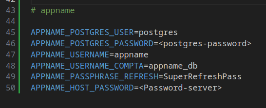
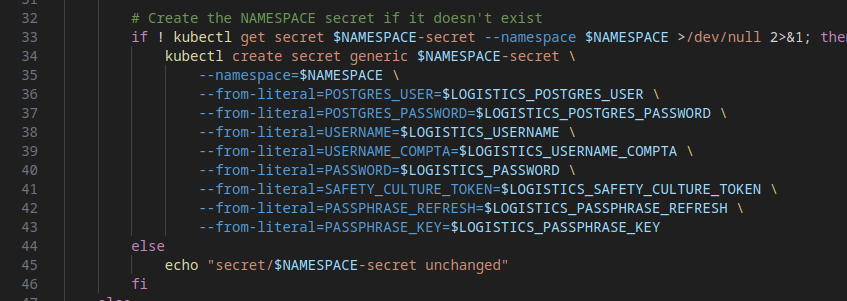
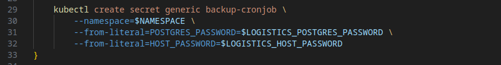

# SERVER DOCUMENTATION

## K3S installation

### Install prerequites

```
sudo apt install -y curl
```

### Install and setup firewall

```
sudo apt-get update && sudo apt-get install ufw
```
```
sudo ufw allow ssh
sudo ufw allow 6443/tcp
sudo ufw allow 10250/tcp
sudo ufw allow 8080/tcp
sudo ufw allow from 10.42.0.0/16
sudo ufw allow from 10.43.0.0/16
sudo ufw enable
```
### K3S
```
curl -sfL https://get.k3s.io | sh -
```
### Helm
```
curl https://raw.githubusercontent.com/helm/helm/main/scripts/get-helm-3 | bash
```
### Cert-manager
```
kubectl apply -f https://github.com/cert-manager/cert-manager/releases/download/v1.14.4/cert-manager.yaml
```
### Ingress
```
helm repo add ingress-nginx https://kubernetes.github.io/ingress-nginx
helm repo update
mkdir -p ~/.kube
sudo cp /etc/rancher/k3s/k3s.yaml ~/.kube/config
helm install quickstart ingress-nginx/ingress-nginx
helm repo add jetstack https://charts.jetstack.io
helm repo update
```
## Deployment of the Applications

<p>We are going to take an exemple of an Application with a database, a backend and a frontend.</p>
<p>There is also a cronjob to perform regulare backup of the database</p>
<p>The application has the following tree structure:</p>

```
|_namespaces
    |_ default/
        |_ configmap.yaml
        |_ apply_secret.yaml
        |_ postgres.pv.yaml
        |_ postgres.storage-class.yaml
        |_ postgres.statefulset.yaml
    |_ appname
        |_ namespace.yaml
        |_ apply_secret.sh
        |_ backup-cronjob-secret.sh
        |_ configmap.yaml
        |_ backup-cronjob.configmap.yaml
        |_ nodejs.deployment.yaml
        |_ front.deployment.yaml
        |_ frontend-url-fr.certificate
        |_ backend-url-fr.certificate
        |_ ingress.yaml
        |_ issuer.yaml
        |_ backup.cronjob.yaml
|_.env
```
### Lunch the App

<p>To run this application you have execute or apply all this files in a specific order</p>


#### Statefulset
<p>Check if a statefulset is already deployed with this command line:</p>

```
kubectl get statefulset
```
<p>If a statefulset is already deployed you can skip this section. Otherwise, execute this command lines:</p>

```
./namespaces/default/apply_secret.sh
kubectl apply -f namespaces/default/configmap.yaml
```
```
kubectl apply -f namespaces/default/postgres.storage-class.yaml
```
```
kubectl apply -f namespaces/default/postgres.pv.yaml
```
```
kubectl apply -f namespaces/default/postgres.statefulset.yaml
```

#### Setup environment

<p>At the root of the cluster you have to update the .env file</p>
<p>You have to write the variables used by your secret files</p>
<p>To avoid conflict with other app, please place in prefix the APPNAME</p>



#### Configmap and secret

```
./appname/apply_secret.sh
./appname/backup-cronjob-secret.sh
kubectl apply -f configmap.yaml
```
#### Deployments

<p>Apply the deployments files to deploy frontend and the backend</p>

```
kubectl apply - f appname/nodejs.deployment.yaml
kubectl apply - f appname/front.deployment.yaml
```

#### Router and SSL

<p>To access to your app in a browser with the domain url, you have to several instances</p>
<p>Firstly, apply the certificates to generate certificates for yours domains</p>

```
kubectl apply -f namespce/backend-url-fr.certificate
kubectl apply -f namespce/frontend-url-fr.certificate
```

<p>Secondly, apply the ingress. This is for link domains url with your app</p>

```
kubectl apply -f namespce/ingress.yaml
```

<p>Thirdly, apply the issuer. The issuer handle regeneration of your SSL certificates when they are going to expire</p>

```
kubectl apply -f namespce/issuer.yaml
```

## Deploy a New App

<p>In this documentation we suppose you want to deploy an app with a database, a backend and a frontend</p>

### Place the .env files

<p>Create a directory with the name of your app</p>

```
mkdir /opt/newapp
```

<p>Create subdirectory for every deployment. Use the name of the deployment.</p>

```
mkdir /opt/environments/newapp/front
mkdir /opt/environments/newapp/nodejs
```

<p>Put your .env files in this subdirectories and the GIT_URL and the GIT_BRANCH</p>

```
GIT_URL=git@github.com:username/newAppBack.git
GIT_BRANCH=master
```

### Create Database

<p>Create the database of your app in the postgres pod</p>

```
kubectl exec -it postgres-0 -- psql -U postgres -c "CREATE DATABASE newappdb;"
```

### Copy and Update Files

<p>Create new directory with name of the new App</p>

```
mkdir /opt/k3s/namespaces/newapp
```

<p>Copy all the files from an existing app</p>

```
cp -r /opt/k3s/namespaces/gestion/* /opt/k3s/namespaces/newapp/
```


#### Update secrets files

In the `/opt/k3s/namespaces/newapp/apply_secret.sh` you must replace the variable by the sensitive variable (like password) in this section:



In the `/opt/k3s/namespaces/newapp/backup-cronjob-secret.sh` you must replace the variable POSTGRES_PASSWORD in this section:



change NAMESPACE value to newapp 

#### Update configmap

In the `/opt/k3s/namespaces/newapp/apply_secret.sh` you must replace the variable by the sensitive variable (like password) in this section:

Change `metadata.namespace: newapp`

#### Update namespace

Change the `metadata.value` in the `/opt/k3s/namespaces/newapp/namespace.yaml` with the name of the app, in this case it will be newapp

#### Update deployments

Int the `/opt/k3s/namespaces/newapp/nodejs.deployment.yaml` and `/opt/k3s/namespaces/newapp/front.deployment.yaml`:
- `metadata.namespace: newapp`
- `spec.template.spec.containers.image: dockerusername/newapp-<deployment-name>:latest`
- In `spec.template.spec.containers.env` you have to change all variable by the one you have in your configmap and your secret.
- For `spec.template.spec.containers.ports.containerPort`, you must specify the host port used to build you image with docker compose.

At the end of the file you have the service link to your deployment. You have to change the following values:
- namespace `metadata.namespace`: newapp
- `spec.ports.targetPort:` with the same value of the `spec.template.spec.containers.ports.containerPort`

#### Update certificates

<p>Rename the certificate files with the domain url it coresponds</p>
example:
- for the frontend: `newapp-fr.certificate.yaml`
- for the backend: `back-newapp-fr.certificate.yaml`

In each certificate files you must change the following values (we tak the frontend as exemple):
- `metadata.name: newapp-fr-tls`
- `metadata.namespace: newapp`
- `spec.secretName: newapp-fr-tls`
- `spec.commonName: newapp.fr`
- `spec.dnsNames: newapp.fr`

#### Update issuer

In the `/opt/k3s/namespaces/newapp/issuer.yaml` change the namespace name:
`metadata.namespace: newapp`

#### Update ingress

In the `/opt/k3s/namespaces/newapp/ingress.yaml` change the following values:
- `metadata.name: newapp-ingress`
- `metadata.namespace: newapp`
- `metadata.annotations.nginx.ingress.kubernetes.io/cors-allow-origin: "newapp.fr"`
- `spec.tls.hosts: newapp.fr`
- `spec.tls.hosts.secretName: newapp-fr-tls`
- `spec.tls.hosts: back.newapp.fr`
- `spec.tls.hosts.secretName: back-newapp-fr-tls`
- `spec.rules.host: newapp.fr`
- `spec.rules.host: back.newapp.fr`


